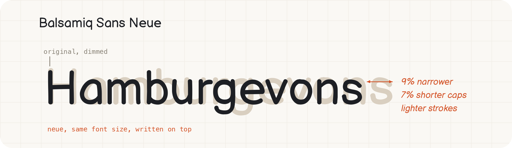

# Balsamiq Sans Neue

This is a modified version of [Balsamiq Sans](https://fonts.google.com/specimen/Balsamiq+Sans) I use in [Koboyo](https://koboyo.com/). I like the hand-drawn style of the font, but it was hard to use it next to normal fonts. So I changed its size, width and weight to make it behave like a normal text font.

## Why

Balsamiq Sans was made for [wireframes and headlines](https://balsamiq.com/). When you use it for normal text or UI:

- The letters are too big for the font size. At the same font size, it looks much bigger than other fonts
- The letters and spacing are too wide, around 10% wider than normal text fonts
- The strokes are too thick, so paragraphs look heavy

I did not redraw anything. The letter shapes are the same as the original. I only fixed the fit, so now you can use it for body text, UI labels, and together with other fonts.

## What I changed

Every style goes through three steps:

- Letters are scaled down (×0.933) so the capitals match the height of normal text fonts
- Letters are narrowed (×0.915), and the spacing and kerning follow
- Every stroke is thinned by 9 units, keeping the round pen ends so it still looks hand-drawn

Kerning, accent positions, underline and strikethrough are all updated to match.

## What is inside

- `fonts/` — the four styles: Regular, Bold, Italic, Bold Italic
- `source/` — the original Balsamiq Sans files and their license
- `scripts/build.py` — the script that builds the fonts

## How to use

Install the four TTF files from `fonts/`. For the web:

```css
@font-face {
  font-family: "Balsamiq Neue";
  src: url("fonts/BalsamiqSansNeue-Regular.ttf");
  font-weight: normal;
  font-style: normal;
}
/* same for Bold (700/normal), Italic (normal/italic), BoldItalic (700/italic) */
```

Bold, italic, bold italic, underline and strikethrough all work. There are only two weights, 400 and 700, same as the original font.

## How to rebuild

```sh
python3 -m venv .venv
.venv/bin/pip install fonttools skia-pathops
.venv/bin/python scripts/build.py
```

If you want different results, change these values in `scripts/build.py`: `SX1`/`SY1` (width and size), `D` (stroke thickness), `TARGET_CAP` (height of capital letters).

## License

Balsamiq Sans is licensed under the SIL Open Font License 1.1 (see `source/OFL.txt`). Copyright 2011 The Balsamiq Sans Project Authors. This modified version uses the same license. I renamed it to Balsamiq Sans Neue because it is a modified version. It is not made or approved by the original authors.
